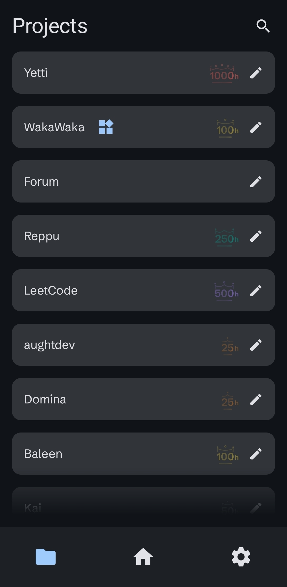
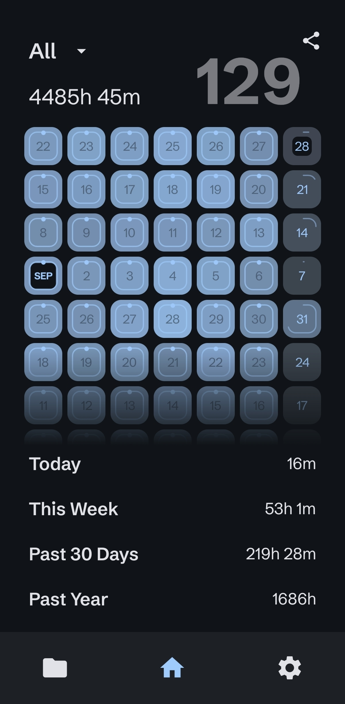
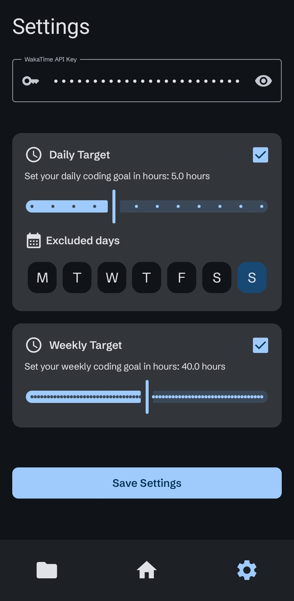
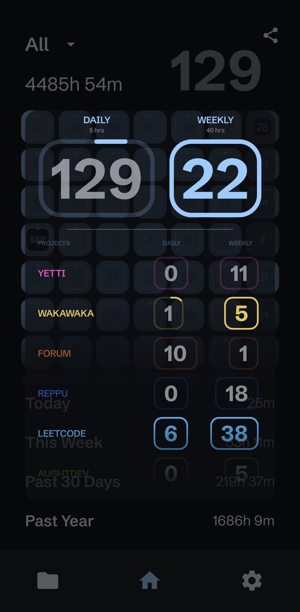
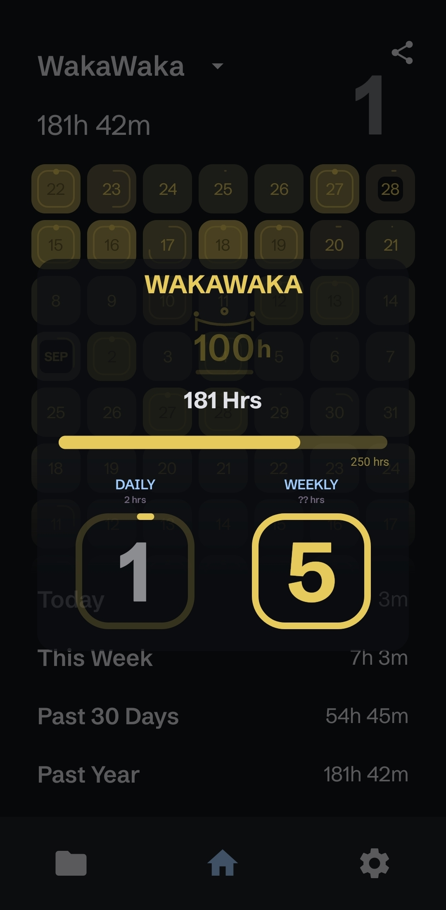
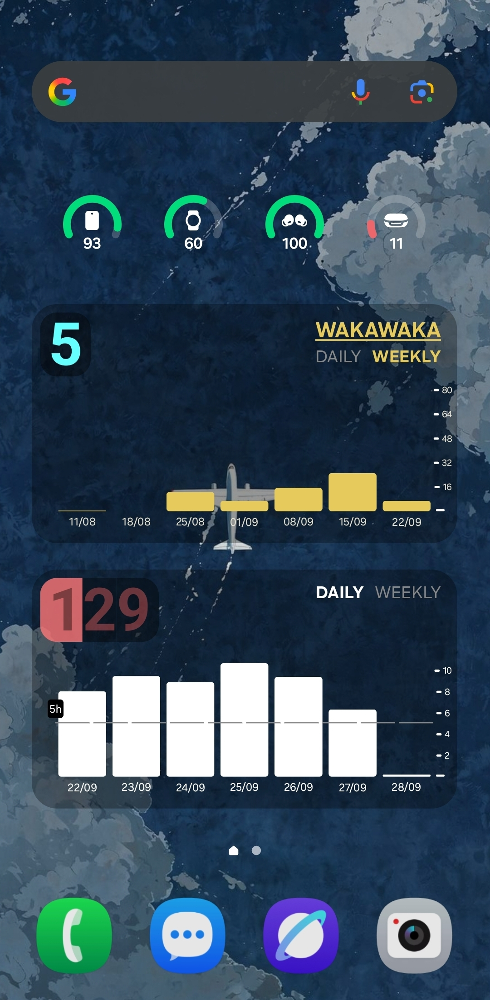
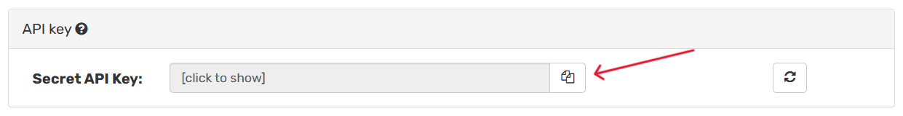
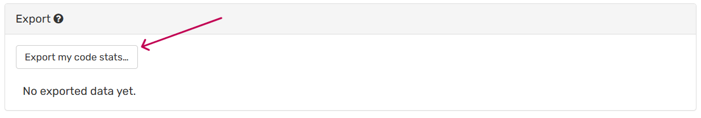
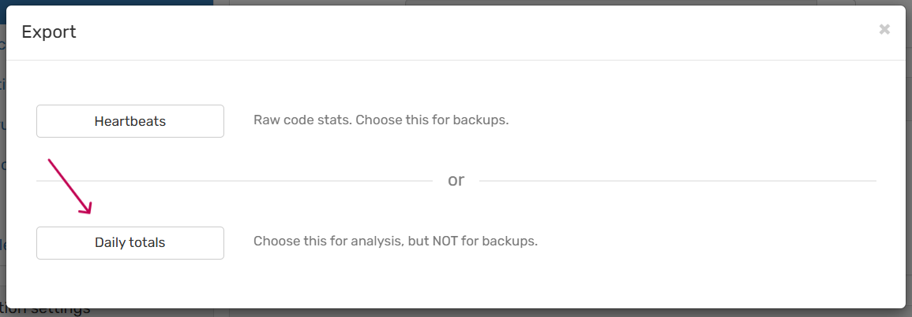

 

# **WakaWaka 📊**

**Your WakaTime stats, on your phone, for free. Forever.**

WakaWaka is a free and open-source Android client for WakaTime. It fetches your coding data and presents it beautifully on your device. Say goodbye to paywalled historical data—WakaWaka keeps all your stats stored locally on your phone, giving you full access to your entire coding history.

## **✨ Features**

WakaWaka is packed with features to help you track and visualize your coding progress.

* **📅 Calendar Dashboard:** View a color-coded calendar of your daily coding activity. Instantly see your duration metrics for **Today**, **This Week**, the **Last 30 Days**, and the **Past Year**.  
* **🎯 Goal Setting & Streaks:** Set custom **daily** and **weekly** coding targets for individual projects or your total activity. The app tracks your progress, notifies you upon completion, and displays your daily **streak** right on the home screen. You can even set "off days" for your daily targets\!  
* **🏆 Project Insights:** Get a detailed breakdown of every project. View your progress with dynamic **bar graphs**, track completion streaks, and earn **badges** for milestones (25hrs, 50hrs, 100hrs, and all the way up to 1000hrs\!).  
* **🎨 Customization:** Personalize your experience by assigning a unique **color** to each project, which is used throughout the app's charts and calendars.  
* **📲 Home Screen Widgets:** Keep your stats front and center with two powerful widgets: one for your aggregate coding data and another for a specific project of your choice.  
* **🖼️ Share Your Progress:** Generate and share beautiful images of your metrics, badges, or full calendar view for any project or your aggregate stats.  
* **💾 Local First Data:** Get started instantly by importing your full WakaTime data dump. All your data is stored **locally**, ensuring privacy and unrestricted access. You can also **backup** and **restore** your app data at any time.

## **📸 Screenshots**

| Projects Tab                                                                                              | Home Tab                                                                                                         | Settings Tab                                                                                          |
|:----------------------------------------------------------------------------------------------------------|:---------------------------------------------------------------------------------------------------------------- |-------------------------------------------------------------------------------------------------------|
|          |           |  |
| **Aggregate Details**                                                                                     | **Project Details**                                                                                              | **Home Screen Widgets**                                                                               |
|  |  |        |

## **🚀 Getting Started**

Setting up WakaWaka is quick and easy.

1. **Download the App**  
   * Head over to the [**Releases**](https://www.google.com/search?q=https://github.com/your-username/your-repo/releases) page.  
   * Download the latest .apk file and install it on your Android device.  
2. **Get Your WakaTime API Key**  
   * Log in to your account on the https://wakatime.com/.  
   * Navigate to your [**Settings**](https://wakatime.com/settings/account) page.  
   * Find your **Secret API Key** and copy it. It will be a long string of characters.

3. **Set Up the App**  
   * Open WakaWaka and go to the **Settings** tab (the rightmost icon on the bottom bar).  
   * Paste your Secret API Key into the designated field and save it. The app will begin fetching your recent data.

4. **(Optional) Import Your Full History**  
   * To get all your historical data, request a data dump from WakaTime.  
   * You do this by going to the [account tab](https://wakatime.com/settings/account) in your settings page, scrolling down to export, then in the modal that pops up, click on "Daily Totals"
   * The data dump will proceed and when it's done, you will receive an email with a link to a json file
   * Once you receive the json file and unzip it, use the **"Import Data Dump"** option in the WakaWaka settings to populate the app with your entire coding history.
   
   
   
   
   
   

## **🤝 Contributing**

This project is open-source and contributions are welcome\! Feel free to open an issue to report a bug or suggest a feature, or submit a pull request with your improvements.

## **📜 License**

This project is licensed under the [Creative Commons Attribution-NonCommercial-ShareAlike 4.0 International License](LICENSE).

In short, this means:

* **You are free to share and adapt** this project for any non-commercial purpose.
* **You must give appropriate credit** and provide a link to the license.
* If you remix, transform, or build upon the material, you must distribute your contributions under the **same license** as the original.
* **You may not use the material for commercial purposes.**
